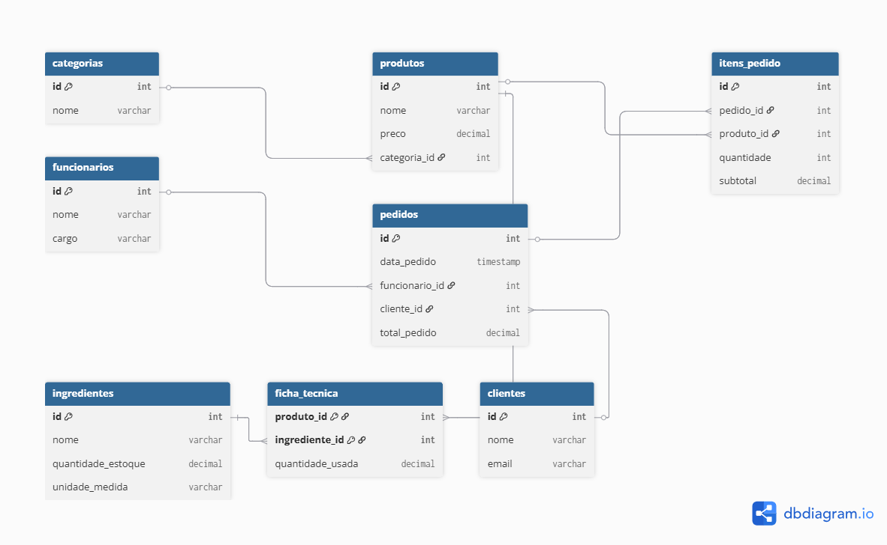

# ☕ Espresso SQL Admin & Cafeteria Project
Projeto completo de modelagem, análise e gestão de dados de uma cafeteria, evoluído de um banco de dados rigoroso para uma aplicação Full-Stack funcional.


---

## 🚀 Navegação Rápida
* [📊 **Casos de Uso**](documents/USE_CASES.md) - Entenda como o projeto resolve problemas reais de negócio.
* [📝 **Dicionário de Dados**](documents/DATA_DICTIONARY.md) - Definição técnica de cada tabela e coluna.
* [💻 **Scripts SQL**](./scripts/) - Estrutura, massa de dados e lógica programada.

---

## 📑 Sumário
* [📌 Sobre o Projeto](#-sobre-o-projeto)
* [🎨 Interface V2.0 (Full-Stack)](#-interface-v20-full-stack)
* [📐 Modelagem (ERD)](#-modelo-entidade-relacionamento)
* [🔄 Fluxo de Dados](#-fluxo-de-dados-e-linhagem-data-lineage)
* [📊 Visualização BI](#-visualização-de-dados-bi)
* [📖 Dicionário de Dados](#-dicionário-de-dados)
* [🏆 Competências](#-competências-demonstradas)
* [🛠️ Como Executar](#-como-executar)

---

## 📌 Sobre o Projeto
Este repositório contém a modelagem completa de um banco de dados para uma cafeteria. Originalmente focado em scripts e consultas analíticas, na **Versão 2.0** o projeto evoluiu para uma **Aplicação Full-Stack**, integrando o SQL Server a uma API em Node.js e um Dashboard administrativo moderno com foco em UX/UI.

---

## 🎨 Interface V2.0 (Full-Stack)
A nova camada visual foi desenvolvida seguindo tendências modernas de design:
* **Tema Purple Dracula:** Estética Dark com acentos roxos e marrom café.
* **Glassmorphism:** Uso de efeitos de transparência e desfoque (*backdrop-filter*).
* **Monitor de Estoque (Gauge):** Gráfico de velocímetro animado que reflete o nível de insumos em tempo real.
* **Terminal de Auditoria:** Feed que exibe os logs gerados pelas Triggers do SQL Server instantaneamente.

---

## 🛠️ Tecnologias Utilizadas
* **Banco de Dados:** Microsoft SQL Server / MySQL (T-SQL).
* **Backend:** Node.js, Express, Driver MSSQL.
* **Frontend:** HTML5, CSS3 (Grid/Flexbox), JavaScript (Vanilla), Particles.js.
* **Modelagem:** dbdiagram.io e GitHub para versionamento.

---

## 📐 Modelo Entidade-Relacionamento
A base do sistema é uma estrutura relacional normalizada (1NF, 2NF e 3NF) projetada para garantir integridade e performance.


> 🔗 **Acesse a versão interativa:** [Visualizar no dbdiagram.io](https://dbdiagram.io/d/Cafeteria-6944645a4bbde0fd74c0c833)

---

## 📖 Dicionário de Dados

### 🛒 Vendas e Clientes
* **clientes**: Informações de consumidores. Possui campo `email` único para evitar duplicidade.
* **pedidos**: Registro de cada venda realizada vinculada a um cliente.
* **itens_pedido**: Detalhamento de produtos por pedido.

### ☕ Gestão de Produtos e Estoque
* **produtos**: Catálogo de itens vendidos e preços.
* **categorias**: Organização (Bebidas, Salgados, Doces).
* **ingredientes**: Controle de insumos (café, leite, açúcar).
* **ficha_tecnica**: Relacionamento **N:N** que define a composição de cada produto para baixa automática.

---

## 🛡️ Segurança e Performance 🔐
* **Triggers**: Auditoria automática de preços e logs de inserção na tabela `log_precos`.
* **Views**: Visão `v_resumo_vendas_por_produto` para simplificar relatórios e dashboards de BI.
* **Indexes**: Índices B-Tree para buscas rápidas em `email` e `data_pedido`.
* **Soft Delete**: O sistema utiliza exclusão lógica (coluna `ativo`). Isso garante a manutenção da Integridade Referencial.

---

## 🔄 Fluxo de Dados e Linhagem (Data Lineage)
O ciclo de vida dos dados segue o percurso estruturado abaixo:
1. **Entrada:** Dashboard envia requisição via API Node.js ou Stored Procedure `sp_registrar_venda`.
2. **Detalhamento:** Itens são registrados e a transação SQL é aberta.
3. **Estoque:** O sistema consulta a `ficha_tecnica` e abate `ingredientes` automaticamente.
4. **Auditoria:** Triggers monitoram alterações e registram no log.
5. **Saída/BI:** Views consolidam dados para Insights no Dashboard.

---

## 📊 Visualização de Dados (BI)
Embora focado no Backend, a estrutura alimenta dashboards de Business Intelligence. Abaixo, um mockup de como as **Views** gerenciais podem ser visualizadas:


---

## 🏆 Competências Demonstradas

| Habilidade | Técnica Utilizada |
| :--- | :--- |
| **Modelagem** | ERD, DFD e Normalização (1NF, 2NF, 3NF). |
| **Full-Stack** | Integração Web -> API Node.js -> SQL Server. |
| **Lógica de Banco** | Stored Procedures e Triggers de Auditoria. |
| **BI / Analytics** | Views Gerenciais e Queries Complexas (JOINs, GROUP BY). |
| **Performance** | Otimização com B-Tree Indexes. |
| **Segurança** | Check Constraints, Soft Delete e Controle de Acesso (DCL). |

---

## 💡 Desafios e Soluções Técnicas
* **Consistência de Estoque:** Implementação de uma **Ficha Técnica (N:N)** com **Stored Procedure** e controle transacional, garantindo baixa atômica.
* **Rastreabilidade:** Criação de sistema de **Auditoria via Triggers**, isolando logs em tabelas dedicadas.

---

## 🛠️ Como Executar o Projeto

1. **Clone o repositório:**
   ```bash
   git clone [https://github.com/seu-usuario/seu-repositorio.git](https://github.com/seu-usuario/seu-repositorio.git)
2. **Prepare o Banco de Dados:**
   Execute os arquivos da pasta /scripts na sequência:

   01_schema.sql (Criação das tabelas)

   02_seed.sql (População de dados)

   04_advanced_features.sql (Views e Triggers)

   05_procedures.sql (Lógica de Procedures)

3. **Inicie o Backend (Node.js):**

   Bash

   npm install

   node server.js

   Acesse a Interface:

   Abra o arquivo index.html no navegador.

#💻 Convenções

Este projeto segue as convenções de nomenclatura snake_case e palavras-chave SQL em UPPERCASE para garantir legibilidade e manutenção.

🐰 conceived and programmed by agenteorelhas 🐰
