# cafeteria-sql-project
Projeto de modelagem e análise de dados de uma cafeteria utilizando SQL.

# ☕ Cafeteria SQL Project
---

## 🚀 Navegação Rápida
* [📊 **Casos de Uso**](./USE_CASES.md) - Entenda como o projeto resolve problemas reais de negócio.
* [📐 **Modelagem de Dados (Interativa)**](https://dbdiagram.io/d/Cafeteria-6944645a4bbde0fd74c0c833) - Visualize o diagrama ER em tempo real no dbdiagram.io.
* [📝 **Dicionário de Dados**](./docs/data_dictionary.md) - Definição técnica de cada tabela e coluna.
* [💻 **Scripts SQL**](./scripts/) - Estrutura, massa de dados e lógica programada.

---
## 📑 Sumário
* [📌 Sobre o Projeto](#-sobre-o-projeto)
* [📐 Modelagem (ERD)](#-modelo-entidade-relacionamento)
* [🔄 Fluxo de Dados](#-fluxo-de-dados-e-linhagem-data-lineage)
* [📊 Visualização BI](#-visualização-de-dados-bi)
* [🏆 Competências](#-competências-demonstradas)

## 📌 Sobre o Projeto
Este repositório contém a modelagem completa de um banco de dados para uma cafeteria, incluindo o script de criação, inserção de dados e consultas analíticas.

## 🛠️ Tecnologias Utilizadas
* SQL (PostgreSQL/MySQL)
* GitHub para versionamento
* dbdiagram.io para modelagem

## 📐 Modelo Entidade-Relacionamento

## 📊 Perguntas que este banco responde:
1. Qual o faturamento total por dia?
2. Quais são os 3 produtos mais vendidos?
3. Qual funcionário realizou mais vendas?

## 📖 Dicionário de Dados

Abaixo, detalhamos a função de cada tabela e suas principais colunas:

### 🛒 Vendas e Clientes
* **clientes**: Armazena informações dos consumidores para programas de fidelidade.
    * `email`: Campo único para evitar cadastros duplicados.
* **pedidos**: Registro de cada venda realizada.
    * `cliente_id`: Chave estrangeira que liga a compra a um cliente.
* **itens_pedido**: Detalhamento de produtos por pedido.

### ☕ Gestão de Produtos e Estoque
* **produtos**: Catálogo de itens vendidos.
* **categorias**: Organização (Bebidas, Salgados, Doces).
* **ingredientes**: Controle de insumos (café, leite, açúcar).
* **ficha_tecnica**: Relacionamento **N:N** que define a composição de cada produto.

### 👥 Recursos Humanos
* **funcionarios**: Cadastro de colaboradores e vendedores.

### 🛡️ Segurança e Performance 🔐
* **Triggers**: Auditoria automática de preços na tabela `log_precos`.
* **Views**: Visão `v_resumo_vendas_por_produto` para simplificar relatórios.
* **Indexes**: Índices B-Tree para buscas rápidas em `email` e `data_pedido`.
* **Soft Delete Implementation**: O sistema utiliza exclusão lógica (coluna ativo). Isto garante a manutenção da Integridade Referencial, permitindo que o histórico de vendas permaneça intacto mesmo após um produto ser retirado do catálogo, evitando erros de "órfãos" em relatórios financeiros antigos.
---

## 🔄 Fluxo de Dados e Linhagem (Data Lineage)

O ciclo de vida dos dados segue o percurso estruturado abaixo:

1. **Entrada:** O dado nasce via Stored Procedure `sp_registrar_venda`.
2. **Detalhamento:** Itens são registrados em `itens_pedido`.
3. **Estoque:** O sistema consulta a `ficha_tecnica` e abate `ingredientes` automaticamente.
4. **Auditoria:** Triggers monitoram alterações em `produtos`.
5. **Saída/BI:** Views consolidam dados para Insights.

```mermaid
graph LR
    A[Cliente/Pedido] --> B(sp_registrar_venda)
    B --> C{Transação SQL}
    C --> D[pedidos / itens_pedido]
    D --> E[ficha_tecnica]
    E --> F[Atualiza Estoque]
    D --> G[View de Faturamento]
    G --> H((Insights BI))
    
    subgraph Auditoria
    I[produtos] -- Alteração de Preço --> J(Trigger)
    J --> K[log_precos]
    end
```

## 💾 Backup e Recuperação
O banco de dados está configurado para suportar backups lógicos via `mysqldump` (ou `pg_dump`), garantindo que a recuperação de desastres possa ser feita em minutos, preservando a integridade das transações e o histórico de auditoria.

---

## 📊 Visualização de Dados (BI)
Embora este projeto seja focado no Backend/SQL, a estrutura foi desenhada para alimentar dashboards de Business Intelligence. Abaixo, um mockup de como as **Views** criadas (`v_resumo_vendas_por_produto`) podem ser visualizadas por um gestor:

---

## 🏆 Competências Demonstradas

| Habilidade | Técnica Utilizada |
| :--- | :--- |
| **Modelagem** | ERD, DFD e Normalização (1NF, 2NF, 3NF) |
| **Lógica de Banco** | Stored Procedures e Triggers de Auditoria |
| **BI / Analytics** | Views Gerenciais e Queries Complexas (JOINs, GROUP BY) |
| **Performance** | Otimização com B-Tree Indexes |
| **Segurança e Integridade** | Check Constraints e Controle de Acesso (DCL) |

---

## 💡 Desafios e Soluções Técnicas

* **Desafio:** Manter a consistência do estoque em vendas de combos.
* **Solução:** Implementação de uma **Ficha Técnica (N:N)** associada a uma **Stored Procedure** com controle transacional (`START TRANSACTION`), garantindo que a baixa no estoque seja atômica e precisa.
* **Desafio:** Rastreabilidade de mudanças de preços por administradores.
* **Solução:** Criação de um sistema de **Auditoria via Triggers**, que isola logs de alteração em uma tabela dedicada (`log_precos`), sem onerar a performance da tabela principal de vendas.
---
## 💻 Este projeto segue as convenções de nomenclatura snake_case e palavras-chave SQL em UPPERCASE para garantir a legibilidade e manutenção do código.
---
### 🐰conceived and programmed by agenteorelhas🐰
